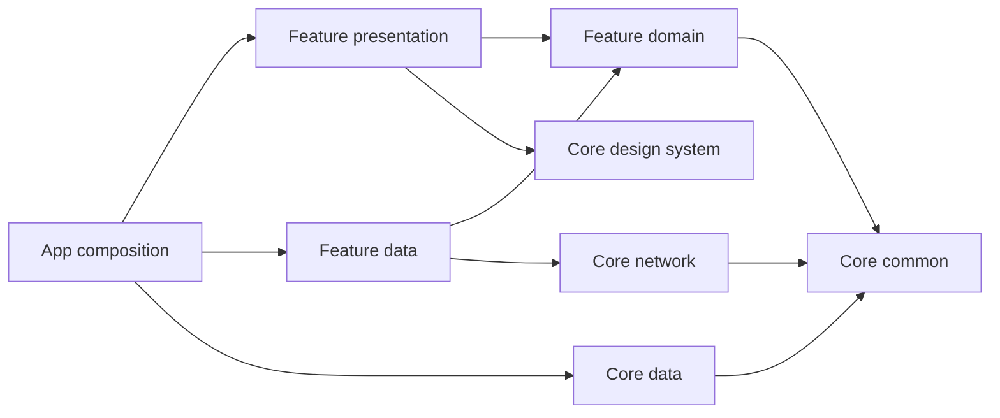

# Fluent Starter

A Flutter monorepo with enforced clean architecture, feature packages, Microsoft-style Fluent UI, and a working authentication example.

The [design system catalog](docs/design-system.md) documents 35 reusable `AppXxx`
widgets, including buttons, typography, fields, dropdowns, pickers, dialogs,
layout and feedback components. Login, home and preferences use the shared widgets.

For Android incremental build failures or the `flutter_web_auth_2` Kotlin
warning, see [Android build recovery](docs/android-builds.md).

## Quick start

Install **Flutter 3.47.5 / Dart 3.13.4** (`.fvmrc` pins Flutter). With FVM, run `fvm install` and use its Flutter/Dart binaries. All commands below run from the repository root with the pinned SDK on `PATH`.

```sh
flutter pub get --enforce-lockfile
dart run melos bootstrap
dart run tool/app.dart run linux dev
```

Replace `linux` with `android`, `ios`, `web`, `windows`, or `macos`. Native builds require their corresponding host/toolchain. Mobile run commands select a single attached device; use `--device=<id>` when more than one is connected. Web uses Chrome by default.

Demo credentials: **demo@example.com / Demo123!**. Every flavor defaults explicitly to **demo**, including release builds; the environment badge remains visible. Google and GitHub buttons sign in with simulated provider accounts. No real server is contacted in demo mode.

```sh
dart run tool/app.dart run android staging --device=emulator-5554
dart run tool/app.dart run web dev
dart run tool/app.dart build web prod --smoke
dart run tool/app.dart run linux dev --api=https://api.example.com
```

`--api` selects the real Retrofit backend and requires an HTTPS origin. It never falls back to demo. The wrapper sets matching `FLAVOR`, `BACKEND`, and native `--flavor` arguments. Web has Dart environment configuration only. Native/Dart flavor mismatches fail at startup. Direct Flutter invocations should pass the same arguments; examples are in `.vscode/launch.json`.

VS Code and Zed configurations include flavor-aware app debugging, run/build tasks, code generation, and workspace checks. Open the repository root and follow [the editor guide](docs/editors.md) for device selection, API backends, profiling, and task shortcuts.

Maintenance tasks are available in both editors and Melos: `pub:get` restores locked dependencies, `app:clean` cleans Flutter app outputs, `app:refresh` runs clean then pub get, and `android:reset` also stops Gradle and backs up its project cache. Run one from the repository root, for example `dart run melos run app:refresh --no-select`.

## Architecture

```text
apps/fluent_starter                 composition, router, platform runners
packages/core/common               pure Dart Result/Failure and storage ports
packages/core/data                 secure credentials and preferences
packages/core/network              injectable Dio/options/interceptors, failure mapping
packages/core/design_system        Fluent themes, tokens and components
packages/core/testing              fakes and mock helpers (tests only)
packages/core/identity/domain      entities, repository contract, use cases
packages/core/identity/data        Retrofit, remote data source, JSON DTOs, repository
packages/features/auth/presentation LoginBloc, Freezed state, Formz, login routes/UI
packages/features/home/presentation dashboard Bloc/UI, shared identity use cases, feature routes
packages/features/settings/domain  theme entity, repository contract, use cases
packages/features/settings/data    persisted appearance preferences
packages/features/settings/presentation appearance Bloc and preferences routes/UI
```



Domain has no Flutter, transport, persistence, JSON, or DI framework imports. Presentation Blocs depend on domain use cases through constructors. Injectable generates package modules for core/network, core/identity/data, auth/presentation, home/presentation, settings/data, and settings/presentation; the app composes them in an isolated GetIt container. GetIt access stays in DI, bootstrap, and route composition. Route pages bind presentation state and events to feature widgets; features do not import each other. Auth and home consume the shared identity domain. The identity data session component owns the session; every observer receives its current snapshot followed by changes. Loading and feedback belong to the Bloc performing an action, and no feature consumes another feature's Bloc.

`tool/check_architecture.dart` checks package dependencies, production imports/exports (including conditional ones), forbidden framework dependencies, private cross-package imports, directory escapes, and cycles. It uses the Dart analyzer AST, not text matching. Generated files are checked too. The allowlist requires an explicit decision when adding a package.

### Shared dependency versions

Root `pubspec_overrides.yaml` is committed and owns the hosted dependency version constraints for this private workspace. Every root/member `pubspec.yaml` declares the dependencies it uses as `any`. Flutter SDK dependencies keep `sdk: flutter`; internal packages resolve through Dart's workspace. Package release versions and SDK constraints stay in each pubspec.

To add a library, declare it as `any` in the consuming package and add its constraint once in root `dependency_overrides`. Run `flutter pub get` and commit the updated root lockfile. Overrides apply to the entire dependency graph, including transitive constraints; upgrade related generators together and run the quality gate. The lockfile records exact resolved versions.

`tool/check_dependencies.dart` rejects repeated versions, missing shared constraints, and dependency overrides in member files. Melos includes this policy in `check`.

### Add a feature

1. Create packages under `packages/features/<feature>/{domain,data,presentation}` as needed, with unique package names, `resolution: workspace`, `publish_to: none`, and the shared SDK constraint.
2. Register each package in root `workspace` and update the dependency allowlist in `tool/check_architecture.dart`.
3. Define entities, repository interfaces, and use cases in domain; implement DTOs/transport/mapping in data; inject use cases into event-driven presentation Blocs.
4. Annotate data implementations and Blocs. Add one `lib/di/injection.dart` per participating package with `@InjectableInit.microPackage`, generate it, and include its module in the app's `lib/di/injection.dart`. Group pure domain use-case bindings in a single `@module` inside the feature data package's `injection.dart`. Keep `@RoutePage` pages under the owning presentation feature. Add a `src/navigation/<feature>_router.dart` annotated with `@AutoRouterConfig`, export its configuration and generated routes through the package barrel, and compose its subtree once in the app. Keep cross-feature coordination in the app.
5. Generate code, add behavior tests, and run the quality gate. Never access another package's `lib/src`.

Use cases return `Success<T>` or `FailureResult<T>`. Data exceptions and DTOs never reach presentation. Freezed handles presentation state; JsonSerializable handles wire models. Domain models are plain Dart.

### File organization

Package entrypoints are export-only barrels. Each handwritten implementation file declares one public type, organized by responsibility:

```text
core/identity/domain/lib/
  identity_domain.dart
  src/entities/user.dart
  src/repositories/identity_repository.dart
  src/usecases/login.dart
  src/usecases/logout.dart
  src/usecases/restore_session.dart

core/identity/data/lib/
  di/injection.dart
  src/dto/user_dto.dart
  src/requests/login_request.dart
  src/responses/login_response.dart
  src/models/auth_session.dart
  src/session/identity_session.dart
  src/session/persistent_identity_session.dart
  src/services/auth_api.dart
  src/datasources/remote/auth_remote_data_source.dart
  src/datasources/remote/api_auth_remote_data_source.dart
  src/datasources/demo/demo_adapter.dart
  src/mappers/user_mapper.dart
  src/mappers/auth_session_mapper.dart
  src/repositories/remote_identity_repository.dart

features/auth/presentation/lib/
  di/injection.dart
  src/login/bloc/login_bloc.dart
  src/login/bloc/login_event.dart
  src/login/bloc/login_state.dart
  src/login/inputs/{email_input,password_input,input_error}.dart
  src/login/pages/login_view.dart

features/settings/domain/lib/src/
  entities/app_theme_mode.dart
  repositories/settings_repository.dart
  usecases/{load_theme,save_theme}.dart

features/settings/data/lib/
  di/injection.dart
  src/repositories/local_settings_repository.dart

features/settings/presentation/lib/
  di/injection.dart
  src/appearance/bloc/appearance_bloc.dart
  src/appearance/bloc/appearance_event.dart
  src/appearance/bloc/appearance_state.dart
  src/appearance/pages/appearance_view.dart

features/home/presentation/lib/
  src/home/pages/overview_page.dart
  src/home/widgets/home_overview.dart
```

Core packages follow the same convention: storage contracts and implementations, HTTP interceptors, failure mappers, theme, spacing tokens, widgets, and test fakes each have their own files. App composition separates configuration, DI registration, bootstrap, router, guards, and pages.

Presentation code lives under `lib/src/<feature>/`, with Bloc, state, and event files together in `bloc/`. Inputs, pages, and widgets belong to that feature. All variants of one event family live in its `_event.dart`; Freezed state output stays beside its state source. Presentation tests mirror the feature folders. Each participating package keeps its Injectable entry point and generated module in `lib/di/`.

The architecture check requires presentation feature sources under `lib/src/`, with exceptions for the package barrel and `lib/di/`. It enforces export-only package barrels and separates unrelated public types. A sealed base and its direct variants may share a file, which allows an event family to be read together. Private implementation companions are allowed outside UI; generated files follow generator conventions. Feature service-locator imports are restricted to `lib/di/injection.dart` and `lib/src/navigation/<feature>_router.dart`; Blocs, pages, and other helpers cannot resolve dependencies. DI imports in domain remain forbidden. Keep each model's generated `part` next to that model; do not collect models or use cases in a barrel.

### UI contains rendering and event bindings only

Pages and views render presentation state and dispatch Bloc events. They do not call use cases, repositories, storage, or transport; manage subscriptions; await operations; keep application state with `setState`; or decide authentication/navigation outcomes. Conditional widget rendering and layout bindings remain in UI. Validation messages and display-ready user fields belong to presentation state.

- `LoginBloc` owns input validation and submission.
- Identity owns the session snapshot and stream. `GetCurrentSession`, `WatchSession`, `RestoreSession`, `Logout`, and `ExpireDemoSession` are pure domain use cases. Bootstrap awaits restoration once before mounting the app; the demo simulation has its own repository contract.
- `HomeBloc` consumes identity use cases, maps session data into display-ready fields, and owns its loading/feedback. It releases its subscription when the overview route is removed. There is no app adapter or shared presentation Bloc for session access.
- `AppearanceBloc` owns theme loading, conversion to Flutter theme mode, and ordered persistence through settings use cases. Storage failures keep the chosen theme for the current session and expose feedback in state.
- `AppRouter` observes authentication transitions and coordinates protected navigation with `SessionGuard`. UI has no sign-in completion callback or session subscription.

`tool/ui_architecture_visitor.dart` checks UI source for helper methods/functions, asynchronous work, imperative decisions, assignments, and subscription/state-management calls. The package checker also rejects UI imports of domain, data, storage ports, DI, and transport. `app.dart` and files under any `pages/`, `views/`, or `widgets/` directory are covered, including folders nested inside individual features.

`tool/bloc_architecture_visitor.dart` checks every handwritten production file, including files outside UI folders. It rejects references to `Cubit`, `setState`, `StatefulWidget`, `StatefulBuilder`, `ChangeNotifier`, `ValueNotifier`, `ValueListenableBuilder`, and `ListenableBuilder`, plus Flutter `State` inheritance/aliases. Constructor calls, prefixed names, mixins, and tear-offs are covered. Framework and generated widget internals are outside this rule.

### Dependency injection and HTTP providers

`apps/fluent_starter/lib/di/injection.dart` includes six generated micro-package modules. Each participating package has one `lib/di/injection.dart` entry point. Runtime `AppConfig`, `CredentialStore`, and `PreferenceStore` are supplied at the app boundary, allowing platform stores to be replaced in tests. The container also registers itself for route composition. Application dependencies are generated by Injectable. Session restoration and the appearance startup event finish before the app mounts.

`@InjectableInit.microPackage` generates registrations from the package's annotations. Annotate constructors/classes directly for data sources, repositories, Blocs, and the Retrofit factory. Handwritten `@module` bindings are needed for third-party constructors and pure domain classes that cannot carry DI annotations. Each feature data package groups its use-case bindings in its existing `injection.dart`: `IdentityModule` for shared identity and `SettingsModule` for settings. Domain classes retain constructor injection without importing a DI framework.

Adding a use case to an existing feature changes that feature's bindings and generated micro-package module. `AppModule` supplies only shared runtime configuration and transport; the app composes the generated modules. `NetworkModule` constructs the named Dio client in core/network; app bindings supply its `BaseOptions`, transport adapter, and logging interceptor. Each feature module can be initialized with its required infrastructure dependencies and tested without app composition.

| Owner | Injectable registrations |
|---|---|
| Core network `lib/di/injection.dart` | Lazy singleton `Dio` and auth interceptor, both qualified with `mainApi` |
| Identity data `lib/di/injection.dart` and annotated classes/factory | Shared `LoginWithProvider` for authorization admission; factory `Login`, `GetIdentityProviders`, `RestoreSession`, `Logout`, `WatchSession`, `GetCurrentSession`, and `ExpireDemoSession`; lazy singleton datasource contracts, session owner, and repository implementations |
| Auth presentation | Factory `LoginBloc` and shared `AuthRouter` configuration |
| Home presentation | Factory `HomeBloc` receiving identity use cases and shared `HomeRouter` configuration |
| Settings data `lib/di/injection.dart` and annotated repository | Factory `LoadTheme` and `SaveTheme`; `LocalSettingsRepository` bound as `SettingsRepository` |
| Settings presentation | Shared `AppearanceBloc`, receiving settings use cases, and `SettingsRouter` configuration |
| App `lib/di/injection.dart` | `AppEnvironment`; `mainApi` bindings for `BaseOptions`, safe logging interceptor, and `HttpClientAdapter` (demo or platform transport) |
| App routing | Shared `AppRouter` and `SessionGuard` consuming identity session use cases |

The main client uses JSON content type and explicit connection/send/receive timeouts. Core/network attaches its named auth and logging interceptors. Authentication headers are restricted to the API origin. Endpoints marked `@Extra({'authenticated': false})`, including password login and OAuth exchange, bypass authentication. Protected requests without credentials fail locally; a protected HTTP 401 expires only the session used by that request. Logging exposes only method/status/error category. Generated disposal closes the router, shared Blocs, identity session owner, and Dio transport when the container is reset. The session owner waits for pending credential writes and cleanup before closing its stream.

`AuthApi` uses `@lazySingleton` and `@factoryMethod` directly on its Retrofit factory. `@Named(mainApi)` selects its Dio instance. Its optional `baseUrl` is marked `@ignoreParam` so DI uses Dio's configured API origin without a separate API provider module. `ApiAuthRemoteDataSource` injects this service and is registered as `AuthRemoteDataSource` using `@LazySingleton(as: AuthRemoteDataSource)`. The demo-session repository selects the same named client.

Each client owns its `BaseOptions`, adapter, and interceptor instances. There is no `NetworkConfig` wrapper or unqualified Dio registration. The starter configures one backend client. To add another backend:

1. Add its qualifier beside `mainApi` in core/network's `di/network_clients.dart`.
2. Supply that client's named `BaseOptions`, adapter, and logging binding in the existing app `injection.dart`.
3. Add its named Dio provider in the existing `NetworkModule`, with `@LazySingleton(dispose: disposeDio)`. Select credentials and interceptors for that backend; `AuthInterceptor` accepts an `HttpAuthentication` contract and the client's base URL, while `SafeLoggingInterceptor` accepts a logging callback. Their constructors have no fixed client qualifier, so each provider can create separate instances.
4. Select the qualifier on that backend's Retrofit constructor and regenerate. Feature domain, repositories' error boundaries, and `safeApiCall` need no client-specific configuration.

Qualify provider parameters as well as return registrations. Tests exercise two clients with separate URLs, timeouts, credentials, logs, and disposal. Auth DI tests include unrelated named and unnamed clients to verify that generated factories select `mainApi`.

### Safe API and storage boundaries

`safeApiCall` is a public function that executes a request once and converts exceptions into `FailureResult<T>`. Success returns `Success<T>`. It has no DI registration, client configuration, or reporting callback. Data-layer operations call it directly or through `networkBoundResource`; the Dio instance is already selected by the data source inside the closure.

The normal callback takes no arguments:

```dart
final result = await safeApiCall(
  () async => (await _remote.currentUser()).toEntity(),
);
```

Transport, checked JSON decoding, and DTO-to-domain mapping inside the callback share the same error boundary. Synchronous exceptions, asynchronous failures, nullable values, and `void` results are supported.

`mapNetworkFailure` exhaustively handles all **nine** exception types in Dio 5.11.1. Adding a Dio enum value requires updating the switch at compile time.

| Dio exception | Domain failure |
|---|---|
| `connectionTimeout`, `sendTimeout`, `receiveTimeout`, `transformTimeout` | `timeout` |
| `badCertificate` | `security` |
| `connectionError` | Classified underlying cause, or `network` |
| `badResponse` | Classified HTTP response |
| `cancel` | `cancelled` |
| `unknown` | Classified nested cause, response fallback, or `unexpected` |

HTTP 400/422 map to validation, 401 to unauthorized, 403 to forbidden, 404 to not found, 408 to timeout, 409 to conflict, and 429 to rate limited. Every other 4xx maps to `request`; every 5xx maps to `server`. Missing, invalid, or otherwise rejected HTTP responses map to `invalidResponse`. Attached response metadata cannot override an explicit timeout, cancellation, or certificate failure.

Nested Dio errors and explicit infrastructure failures are inspected safely. On native platforms, socket/DNS, HTTP I/O and OS errors map to `network`; TLS/handshake/certificate errors map to `security`. Browser connection failures use Dio's `connectionError` type; conditional imports keep native APIs out of web builds. `FormatException`, checked JSON errors and mapping type errors become `invalidResponse`; genuinely unknown causes retain the `unexpected` fallback. Failure messages do not copy raw exception text or server bodies.

Storage uses the pure Dart `safeStorageCall` helper from core/common, with an optional user-facing message. It preserves `FailureKind.storage` for keychain/preferences failures. `Result.flatMap` continues successful steps and skips subsequent work after a failure; each I/O step uses its corresponding safe boundary. Auth and settings repositories contain no `try/catch` blocks. Identity delegates session lifecycle and persistence consistency to `IdentitySession`. The storage datasource contract remains `CredentialStore`; it only reads, writes and deletes credentials.

Cancellation belongs to the Dio/Retrofit request. When needed, pass a token inside the closure; Dio emits a cancellation exception that the function maps to `FailureKind.cancelled`:

```dart
final result = await safeApiCall(
  () => api.me(cancelToken: cancelToken),
);
```

The helper performs no retries, backoff, cancellation scheduling, logging, or telemetry. Retry behavior, if introduced for a specific endpoint, must account for whether that operation can safely be repeated.

### Network resources and local session ownership

`networkBoundResource<Remote, T>` is the fetch-and-commit form of a network-bound resource. `fetch` runs through `safeApiCall`, including DTO validation/mapping. Only successful remote data reaches `save`, which returns a typed `Result<T>` from the local source of truth. A storage failure remains a storage failure, and success is returned only after the local commit completes. This function has no cache-first emission, automatic retry, or DI registration.

The repository selects the datasource call and maps its response:

```dart
final request = LoginRequest(email: email, password: password);
return _session.authenticate(
  () async => (await _remote.login(request)).toSession(),
);
```

`IdentitySession` owns a complete session operation. Its implementation uses `networkBoundResource` to commit only validated responses, `CancelableOperation` to discard superseded results, `Lock` to order credential writes/cleanup, and `BehaviorSubject` to replay the current session to observers. These are internal data-layer mechanisms; the repository has no operation IDs, counters, credential checks or HTTP status handling. Provider availability and admission policy stay in domain use cases.

`CredentialStore` is the local datasource contract. `AuthRemoteDataSource` is a plain interface for password login and user lookup; `ApiAuthRemoteDataSource` implements it using the Retrofit `AuthApi` service. `OAuthRemoteDataSource` has a separate browser implementation that uses `AuthApi` for code exchange. HTTP annotations and Dio options stay in the API service. Neither datasource owns runtime session state.

`AuthInterceptor` consumes `HttpAuthentication`, supplied by the same session owner used by the repository. Network does not import identity or presentation. The session owner has no Dio dependency, so this wiring cannot recurse through the HTTP client. Logout publishes a signed-out state immediately and waits for credential cleanup. A cancelled write's cleanup completes under the same lock before any newer write can commit. See [session boundaries and concurrency](docs/identity-session.md).

### Generated navigation

Each feature presentation package owns its pages, route tree, and generated `PageRouteInfo` classes. `@RoutePage` lives beside that feature's Bloc and widgets. `@AutoRouterConfig` in `src/navigation/<feature>_router.dart` generates `<feature>_router.gr.dart` in the same package. Public barrels export the configuration and generated routes, so consumers never import another package's `src`.

```text
auth/presentation/lib/
  auth_presentation.dart
  di/injection.dart
  di/injection.module.dart
  src/navigation/auth_router.dart
  src/navigation/auth_router.gr.dart
  src/login/pages/login_page.dart
  src/login/pages/login_view.dart
  src/login/bloc/...
```

With auto_route 11.2.0 / generator 10.6.0, `@AutoRouterConfig` can annotate a configuration class without extending `RootStackRouter`: code generation produces self-contained route information and page builders. `AuthRouter`, `HomeRouter`, and `SettingsRouter` supply route lists only; they create no extra navigation controllers or histories. `AppRouter` is the single running `RootStackRouter`. The old `AutoRouterConfig.module()` API is not used.

App composition merges feature route trees:

```dart
...authRouter.routes,
AutoRoute(
  page: AppShellRoute.page,
  path: '/home',
  guards: [sessionGuard],
  children: [...homeRouter.routes, ...settingsRouter.routes],
),
```

Auth owns `/login`; home supplies `HomeRoute` at the empty child path, and settings supplies `SettingsRoute` at `preferences`. Each tab entry hosts an `AutoRouter` with the feature-owned pages beneath it. `/home` and `/home/preferences` retain their URLs. Only `AppShellPage` is generated in `app_router.gr.dart`; the shell combines feature entry routes in `AutoTabsRouter` and binds the Fluent navigation pane to tab state. The app tab list contains only `HomeRoute` and `SettingsRoute`. Add future home/settings pages beneath those feature roots; their local stack handles push, deep links, and back without changing app page adapters or tab declarations. A new top-level tab or cross-feature flow still requires app composition.

`AuthRouter` binds `LoginRoute.page` directly to `BlocProvider(create: (_) => container<LoginBloc>())`; `HomeRouter` does the same for `HomeBloc`. These providers own fresh factory Blocs and close them when routes are removed. Pages contain no service locator or factories. Bootstrap provides the shared appearance Bloc by value; its lifecycle belongs to the DI container. `LoginSubmitted` uses `droppable()`; email/password edits are ignored while submitting.

Feature-local navigation uses its generated route types. The app can navigate across features with `AppShellRoute(children: [SettingsRoute(children: [PreferencesRoute()])])`, importing `PreferencesRoute` from settings' public barrel. For a feature-initiated cross-feature flow, define a small contract in the requesting feature and implement it in app composition using the target's public route; do not import app or another feature's presentation. No central registry of string destinations or universal navigator interface is required.

Opening `/home/preferences` without a session redirects to login. The app router observes authenticated session state and asks the guard to resume the pending destination. Logout and session expiry clear the protected stack. Pages render state and dispatch events; navigation decisions and subscriptions stay outside UI.

## Authentication and storage

The demo adapter implements Dio's HTTP transport, so the example exercises Retrofit, remote data source, checked JSON parsing, DTO mapping, repository, use case, Bloc, and UI. Its API contract is documented in [docs/backend.md](docs/backend.md).

- Native credentials use OS secure storage; web credentials are memory-only and require login after refresh. Theme preferences persist on every platform.
- Credential keys are namespaced by flavor and backend mode. No password is persisted.
- Bootstrap restores and verifies a stored token before routing. A protected deep link is resumed after login. Logout or an expired session removes the protected route stack.
- Network failures preserve stored credentials for retry; a 401 from session verification clears them. Storage failures return an explicit domain failure.
- Home offers **Check session** and, in demo mode, **Expire demo session**. Invalid credentials, `timeout@example.com`, and `server@example.com` demonstrate error handling; use any valid-length password for the last two.
- HTTP logs include only method/status/error category, never URL, bodies, credentials, or headers; logging is disabled in profile/release builds.
- Google/GitHub use a backend-mediated browser flow with PKCE, state validation and a one-time application code. See [provider setup and backend contract](docs/oauth.md). Demo works locally; live OAuth needs a backend and provider registration.
- Refresh-token rotation, account linking/registration, analytics, and a backend server implementation remain outside this starter's contract.

## Commands and generated files

```sh
dart run melos run generate --no-select
dart run melos run check --no-select
dart run melos run flavors --no-select
```

`generate` runs build_runner in dependency order, then formats the workspace with the pinned Dart SDK. The formatting step also normalizes Injectable's micro-package output. `check` runs format verification, dependency policy, architecture validation, analysis, and all package/root tests. Individual scripts are `format`, `format-check`, `dependencies`, `architecture`, `analyze`, and `test`.

Commit root `pubspec_overrides.yaml`, `pubspec.lock`, `*.g.dart`, `*.freezed.dart`, `*.gr.dart`, `*.config.dart`, and `*.module.dart`. Injectable produces app `injection.config.dart` and six package `injection.module.dart` files; auto_route produces `app_router.gr.dart` plus the three feature router files. Do not edit generated code. Freezed is pinned to **4.0.1** because 4.0.2 requires an analyzer version outside auto_route_generator's supported range. Upgrade the generator toolchain together, regenerate, and rerun checks.

Run the Melos `flavors` wrapper: it also restores the Flutter Runner scheme build/preparation actions omitted by Flavorizr 2.6, preserving Swift Package Manager support.

Native flavor files are generated from `apps/fluent_starter/flavorizr.yaml`. Its explicit processor list excludes sample Dart code generation and Podfile processors because the current Apple runners use Swift Package Manager. Review and commit regenerated native files. Never replace the custom bootstrap with Flavorizr's sample pages.

## Platforms and build verification

| Platform | Host prerequisites | Smoke build |
|---|---|---|
| Android | JDK 17, Android SDK 36, build tools 36, Flutter-selected NDK | `dart run tool/app.dart build android dev --smoke` |
| iOS | macOS and compatible Xcode | `dart run tool/app.dart build ios dev --smoke` |
| Web | Flutter web SDK; Chrome for running | `dart run tool/app.dart build web dev --smoke` |
| Linux | clang, cmake, ninja, pkg-config, GTK 3, libsecret | `dart run tool/app.dart build linux dev --smoke` |
| Windows | Visual Studio C++ desktop workload, CMake | `dart run tool/app.dart build windows dev --smoke` |
| macOS | macOS and compatible Xcode | `dart run tool/app.dart build macos dev --smoke` |

Replace `dev` with `staging` or `prod`. Android smoke builds are debug APKs; Apple smoke builds omit code signing. Distribution signing must be configured before publishing. The repository has no deployment workflow.

Linux secure storage needs a running Secret Service, such as GNOME Keyring or KWallet, in addition to libsecret. macOS uses the legacy OS keychain (`usesDataProtectionKeychain: false`) to avoid requiring Keychain Sharing for this standalone app. macOS sandbox networking and Android internet access are enabled; Android app backup is disabled to avoid restoring encrypted credentials without their keys. iOS app signing is configured locally in Xcode for physical-device execution.

GitHub Actions runs the quality gate plus all **six platforms × three flavors** on appropriate hosts. Apple/Windows build jobs must actually run before claiming those platforms verified; a Linux host cannot validate their native toolchains. The native integration smoke test also exercises actual credential storage:

```sh
cd apps/fluent_starter
flutter test integration_test/app_flow_test.dart -d linux --flavor dev --dart-define=FLAVOR=dev --dart-define=BACKEND=demo
```

On Linux, `bash tool/test_linux.sh` creates an isolated temporary keyring and starts Xvfb/DBus; install `gnome-keyring`, `xvfb`, and `xauth` to use it. CI runs this wrapper.

If running the raw command, use a disposable dev keychain: it signs out the current dev/demo session before and after testing. Use a graphical desktop or Xvfb with a Secret Service. Widget integration tests use in-memory storage and need no desktop session.

## Rename the starter

Change app labels and platform IDs in `flavorizr.yaml`, regenerate flavors, and review the native diff. Update the Android namespace/Kotlin package, base Apple/desktop identifiers, web title/manifest, and the storage namespace in `AppConfig`. If changing Dart package names, update pubspec dependencies, package imports, the architecture allowlist, and generated code together.

The initial IDs are `dev.example.fluentstarter.dev`, `.staging`, and `dev.example.fluentstarter` for prod. UI copy is English; Fluent and Flutter localization delegates are wired. Add app-owned ARB localization when introducing another language.

Changes use atomic Conventional Commits with the configured Git identity and no co-author trailer.
