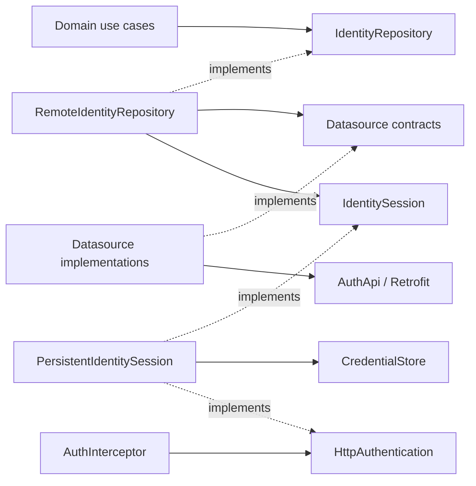

# Identity boundaries

| Layer | Contract / implementation | Responsibility |
| --- | --- | --- |
| Domain | `Login`, `LoginWithProvider`, `Logout`, `RestoreSession` | User actions and provider availability/admission policy |
| Domain | `IdentityRepository` | The identity API consumed by use cases |
| Data repository | `RemoteIdentityRepository` | Select a datasource call, map DTOs, delegate a session operation |
| Remote datasource | `AuthRemoteDataSource` / `ApiAuthRemoteDataSource` | Password login and user lookup through the API service |
| Remote datasource | `OAuthRemoteDataSource` / `BrowserOAuthRemoteDataSource` | Browser authorization, callback validation and code exchange |
| API service | `AuthApi` | Retrofit endpoints, HTTP annotations, DTO serialization and the named Dio client |
| Local datasource | `CredentialStore` / platform implementations in core/data | Read, write and delete credentials |
| Session data | `IdentitySession` / `PersistentIdentitySession` | Current session, observation, restoration and consistent credential commits |
| Network | `AuthInterceptor` / `HttpAuthentication` | Authenticate requests and report rejected request credentials |
| Presentation | Feature Blocs, router and guard | Renderable state, events and navigation based on domain session state |

`CredentialStore` already supplies the local datasource contract. An additional
`AuthLocalDataSource` forwarding the same methods would duplicate that boundary.
The previous stateful datasource has been removed. Datasources do not publish
application session transitions; the session component owns those transitions.

Remote datasource contracts contain no Retrofit annotations or Dio types.
`ApiAuthRemoteDataSource` adapts password login and user lookup to `AuthApi`;
`BrowserOAuthRemoteDataSource` coordinates browser authorization and uses the same
API service for the code exchange. Repositories consume the datasource contracts.
The generated HTTP implementation stays in `src/services/auth_api.g.dart`.

The identity micro-package binds `IdentitySession` and the named `mainApi`
`HttpAuthentication` to one `PersistentIdentitySession`. It depends only on
credential storage, never on Dio or a repository. Dio's interceptor can therefore
depend on the session owner without creating a dependency cycle. No app service,
per-feature bridge or presentation Bloc is involved.

## Repository and session operations

`authenticate(request)` describes a complete authentication/credential-commit
operation. The repository supplies the datasource call and DTO mapping. The session
component executes it through `networkBoundResource` and publishes authentication
only after credential persistence succeeds. This contract keeps operation counters,
storage sequencing and cancellation bookkeeping out of repository methods.

`restore(loadUser)` reads stored credentials and calls the supplied user lookup
when credentials exist. Missing storage publishes a signed-out session without
sending HTTP. Concurrent restores share the pending operation. A pending sign-in
takes precedence over a restore. HTTP errors are handled by the interceptor and
network failure mapper, not by `restore` checking response status codes.

`logout()` publishes signed-out state immediately, prevents pending operations
from publishing, and completes after credential deletion. Storage failure is
returned to the caller; the running process will not reuse the rejected credential.
`readCredentials()` only reads/caches request credentials; it does not publish a
session transition.

## Concurrency implementation

- `BehaviorSubject` owns snapshot replay and stream subscriptions. New observers
  receive the current session followed by changes; closing one observer does not
  close other subscriptions.
- `CancelableOperation` marks superseded sign-in/restore operations. Their results
  cannot update the session. Cancelled sign-in completion waits for the original
  request/browser operation to settle, so another provider cannot open a competing
  browser dialog. Logout itself does not wait for that browser.
- `Lock` protects credential reads, writes and cleanup. If logout or a newer sign-in
  cancels an ongoing write, its cleanup runs under the same lock before a newer
  credential can be written. Disposal waits for active storage work before closing
  the session stream. There is no handwritten queue, public revision or begin/commit
  protocol for callers.

These primitives implement data consistency. Provider availability and admission
remain use-case policies, and UI loading state remains in each feature Bloc.

## Request authentication and expiry

Same-origin requests require authentication by default. Password login, OAuth
authorization and code exchange explicitly opt out with
`extra['authenticated'] = false`. The interceptor has no hardcoded endpoint paths.
Other origins receive no credential and cannot expire this client's session.

A protected request without a credential fails locally with an unauthorized
failure. A protected HTTP `401` reports the credential used by that request to the
session owner. Public `401`, `403`, network failures and timeouts do not expire the
session. A failed credential cleanup preserves its storage-failure classification.

`AccessCredential` represents one issuance of a credential. A new successful login
creates a new instance even when the backend returns the same token text. The
interceptor associates that instance with its request using a weak `Expando`;
metadata is not serialized into Dio's `extra` map. The session owner compares it
with its active credential before invalidating anything. Consequently, a delayed
`401` from an old session cannot erase a newer session, including an identical-token
login. Its string representation is redacted.

There is no refresh-token backend contract yet. Current protected `401` handling
expires the session; it does not invent a refresh endpoint or retry the request.
Adding refresh requires a defined token response, atomic token rotation, one
concurrent refresh per credential and bounded replay of eligible requests. That
work belongs at the HTTP authentication boundary with credential commits owned by
the session component; it must not reintroduce HTTP checks into a repository or UI.
