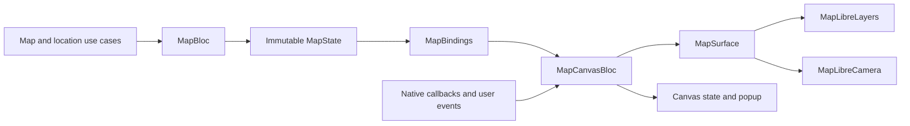

# Map architecture

The map feature separates screen data from native rendering. Device location
is a shared capability under `core/location`, so another feature can use it
without importing the map feature.

## Responsibilities

| Component | Responsibility |
| --- | --- |
| `core_location_domain` | Location fixes, repository contract, and use cases. |
| `core_location_data` | Geolocator, foreground permission checks, GPS access, and settings launches. |
| `MapBloc` | Fetching layer/location data, retries, and location recovery actions. |
| `MapState` | Screen data and presentation messages; the single source of loaded data. |
| `MapBindings` | Forwarding changed `MapContent` snapshots as canvas events. |
| `MapCanvasBloc` | Style readiness, render scheduling, selection, and camera intent. |
| `MapSurface` | The rendering port used by canvas orchestration and test doubles. |
| `MapLibreSurface` | Binding that port to one native controller for its lifetime. |
| `MapLibreLayers` | Native source/layer updates and feature hit testing. |
| GeoJSON encoders | Pure conversion of domain data to GeoJSON. |
| `MapLibreCamera` | Native camera updates, bounds, and padding. |

Widgets render state and dispatch events. Neither Bloc depends on the other.
`MapBloc` imports no map SDK and owns no native resources. The dependency
checker enforces these boundaries and rejects feature dependencies from the
shared location packages.

## Lifecycle and ordering

`MapLibreSurfaceFactory` creates a surface after `onMapCreated`, when the native
controller exists. The surface's layer and camera components use that same
controller. Runtime-bound rendering components are not application singletons.
`MapLibreMap` owns controller disposal; the canvas Bloc releases its reference
and cancels its style timer when the route closes.

Each canvas event has its own typed `on<Event>` registration and named handler.
A shared `synchronized` lock serializes access to the native canvas across those
handlers. Applying `sequential()` separately to each registration would only
serialize events of the same type, allowing source writes and camera operations
to interleave. The lock also checks disposal before a waiting operation starts.

Data arriving before style readiness is retained in canvas state. Once
`onStyleLoadedCallback` fires, the canvas restores the current layer, location,
and camera focus. Replacing the style follows the same path because MapLibre
removes custom sources and layers during a style change.

Source and layer existence are checked independently. If source creation
succeeds and layer creation fails, retrying still creates the missing layer.
An existing source is updated with one `setGeoJsonSource` call.

Camera focus is explicit canvas state. A user can request their position while
GPS is pending, then choose the tourism layer; the later GPS result updates its
marker without overriding that newer camera choice. GPS updates also preserve
an open place popup and do not rewrite unchanged tourism data.

MapLibre GL 0.27.1 exposes a style-ready callback but no widget-level style-error
callback. A 25-second canvas timer makes stalled loading recoverable. Timer
state distinguishes an expired attempt from a newer reload without a revision
counter. Asynchronous rendering checks the active surface before continuing
after disposal.

## Validation

Tests cover independent screen loading, request concurrency, UI event bindings,
data before style readiness, style replacement, camera intent, selection,
partial layer creation, GeoJSON coordinate order, and disposal during an
in-flight native operation. Rendering tests substitute the `MapSurface` port;
adapter tests exercise the actual layer implementation against a mocked native
controller.

## References

- [Flutter architecture recommendations](https://docs.flutter.dev/app-architecture/recommendations): separation of concerns, immutable models, and logic outside widgets.
- [Bloc architecture](https://github.com/felangel/bloc/blob/master/docs/src/content/docs/architecture.mdx): communication through presentation bindings without Bloc-to-Bloc dependencies.
- [MapLibre annotations and style layers](https://github.com/maplibre/flutter-maplibre-gl/blob/main/website/docs/concepts/annotations-vs-layers.md): readiness, style replacement, batched updates, and feature queries.
- [MapLibre GeoJSON sources](https://github.com/maplibre/flutter-maplibre-gl/blob/main/website/docs/layers/geojson-source.md): source creation and replacement.

The component boundaries above are project design decisions based on these
constraints; they are not an architecture prescribed by the map SDK.
