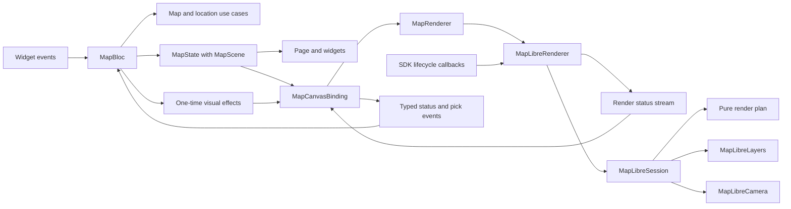

# Map architecture

One `MapBloc` owns the page state: loaded places, live location, selected place,
camera intent, and render status. Native resources belong to the route-owned
MapLibre adapter. Shared location remains under `packages/core/location`.

Domain values use Equatable. Presentation state and `MapScene` use Freezed.
Datasources expose DTOs and technical exceptions; repositories select and combine
sources, map entities, and return domain failures. No SDK controller, Flutter UI
type, or raw platform exception crosses the Bloc contract.

The MAPID mapper removes a known corrupted alias suffix from place names. The
API already contains Unicode replacement characters, so the lost alias cannot
be recovered by changing fonts. Raw DTOs retain the response; valid Unicode and
other parenthetical names are preserved in domain values.

## Presentation structure

`lib/di` contains Injectable composition. Feature implementation lives under
`lib/src/map`: `bloc`, `models`, `bindings`, `pages`, `widgets`, `gestures`,
and `rendering`.
AutoRoute configuration lives under `lib/src/navigation`.

| File | Responsibility |
| --- | --- |
| `map_effect.dart` | Typed one-time visual commands and place-pick requests. |
| `map_render_status.dart` | SDK-free canvas availability reported in page state. |
| `map_canvas_binding.dart` | Connects scenes and effects to the renderer; returns status and pick events. |
| `map_renderer.dart` | SDK-free rendering contract used by the binding. |
| `maplibre_renderer.dart` | Latest desired scene, native attachment, stable status observation, and session replacement. |
| `maplibre_session.dart` | One controller's readiness, timeout, serialized operations, and applied state. |
| `map_render_plan.dart` | Pure diff, confirmed source/camera baseline, and related change types. |
| `maplibre_camera.dart` | Camera bounds, zoom, recentering, and continuous follow. |
| `maplibre_layers.dart` | GeoJSON encoding, native sources/layers, heading asset, and visual hit testing. |

Related presentation contracts, enums, and payloads can share a file. Internal
layer IDs and encoders stay private to their implementation. Domain entities,
DTOs, repositories, and use cases have separate files. Architecture checks focus
on dependency, I/O, and resource ownership boundaries.

`MapState.scene` holds the layer, location, and focus directly. One Bloc owns
page state and calls use cases; it never imports the renderer or its binding.
Every event has a typed registration and its own handler. The location button sends one event; the Bloc
requests focus and decides whether to acquire location or open settings.
Widgets render state and dispatch events. Header, viewport, and location-card
builders select only their displayed fields, so compass updates leave unrelated
widgets and an open popup intact.

## Lifecycle and asynchronous work

The feature route creates `MapBloc` and `MapLibreRenderer` through Injectable.
It connects them with one `MapCanvasBinding`, which receives streams and an event
callback rather than holding or resolving a Bloc. The binding forwards changed
scenes and one-time visual effects to the rendering contract. Render statuses and
successful picks return as typed Bloc events. Status-only state changes never
trigger another render. Native widget callbacks go directly to the adapter.

The route releases the binding subscriptions, Bloc, and renderer on removal.
The SDK widget owns controller disposal; each session owns its timeout, status
stream, and operation queue. Replacing a controller closes its old session.
The adapter replays its latest status to late observers. The Bloc owns its effect
stream and location subscription; closing it releases both.

Layer requests use `restartable()`; the binding uses `switchMap` for native picks.
A late response cannot replace newer data or reopen a dismissed popup. Pick
results carry the layer and selection they were requested against, and the Bloc
checks both before applying them. Handlers apply results to current state,
preserving GPS updates and camera intent received during I/O. A delayed Settings
failure cannot replace feedback after location has recovered.

A change of camera focus travels through scene state and produces one movement.
Pressing the same focus action again emits a one-time recenter effect instead,
so equality does not suppress an explicit request. Zoom and style reload are
also effects. The binding discards a queued recenter superseded by a pan.

One session lock serializes native work. Waiting scene updates coalesce into the
newest scene. Explicit commands, including zoom, remain ordered between draws.
After source I/O, the session reads the latest camera intent, so a pan supersedes
an old follow request. Camera progress does not wait for continuous sensor input
to stop. Pending work and late status emission are discarded after session close.
An already-issued platform call may finish against its original controller.

Native creation and style loading each have a 25-second deadline. If the native
controller never arrives, the adapter reports `creationTimeout`; the canvas
selector unmounts the stalled SDK widget. Retry returns to `waitingForMap`, which
mounts a fresh native view while preserving page data, selection, and GPS. Late
creation after the deadline is ignored. Attachment and route disposal cancel the
creation timer. This is a timeout fallback: the SDK does not provide a widget
callback for reporting native initialization failures.

Sources are written only after style readiness. Reloading or replacing a style
restores custom sources, layers, and current camera intent. A 25-second timeout
reports stalled style loading because MapLibre GL 0.27.1 has no widget-level
style-error callback. Successful loading, replacement, and disposal cancel it.

The render plan tracks confirmed sources and camera progress independently.
A successful operation advances only its own baseline. Source failures invalidate
source progress; camera failures preserve confirmed source content. Hit-test
failures preserve both baselines and the current selection. Native exceptions
and stack traces remain in the internal `map.renderer` diagnostic log.
A native camera cancellation preserves source progress but invalidates camera
progress. It waits for the next scene or explicit action rather than immediately
fighting a user gesture. Android cancellation returns `false`; an iOS `null`
animation acknowledgment is accepted according to the plugin contract.

Layer equality includes its name and ordered place values. Identical refreshes
need no native write or camera refit and preserve the popup. Changed attributes
update selection by stable ID; removing that ID clears it. GPS updates and layer
refreshes respect the current camera focus. Explicit focus commands recenter even
when scene values are unchanged.

## Location and heading

`WatchLocation` coordinates `LocationAccessRepository`, `LocationRepository`,
and `AppLifecycleRepository`. Each visible session checks access, requests
permission if denied and prompting is allowed, then starts location acquisition.
Only the first session of an explicit request may prompt; resuming is passive.
A failed session does not end lifecycle observation, so returning from Settings
can recover access. Hiding the app or cancelling the use case cancels the current
acquisition and releases its sensors. `GetCurrentLocation` follows the same
check/request/read sequence for a one-time user request.

`DeviceLocationAccessRepository` exposes separate read-only access checks,
permission requests, and Settings commands through `LocationAccessDataSource`.
It translates permission values and technical exceptions to domain results;
the use case decides whether to prompt or start tracking. The access check emits
one result as a stream so cancellation between pending platform calls stops
subsequent checks. Cancelling the use case also prevents a later dialog or sensor
acquisition; an already-open OS permission dialog cannot be dismissed this way.

`DeviceLocationRepository` only reads positions and combines `LocationDataSource`
GPS fixes with `CompassDataSource` readings, mapping DTOs and exceptions to domain
values and failures. It does not manage permission policy or call another
repository. Compass failure is logged and falls back to GPS movement bearing
while location tracking continues.

`safeLocationCall` and `safeLocationStream` centralize the location data error
boundary. Repositories return their mapped results inside these functions;
technical failures become domain failures through `mapLocationException`, with
the original error and stack trace retained in the internal diagnostic log.
Neither function retries operations or requests permission. Stream acquisition
is deferred until subscription, cancellation reaches the source, and the GPS
repository still owns the rule that a failed acquisition ends its session.

The GPS datasource only reads positions and configures native acquisition;
the access datasource only calls permission, service, and Settings APIs.
Neither depends on another datasource or decides when tracking should resume.
`OpenLocationSettings` delegates an explicit user action through the access
repository to the access adapter. Flutter visibility observation lives in shared
`core/lifecycle`, outside location and map implementations.

Android requests high-accuracy positions at a one-second interval. A 20-second
first-fix deadline is cancelled after the first result, so stationary tracking
does not time out. Backgrounding releases sensors. Resuming checks access again
without prompting; only an explicit request may open the permission dialog.
The lifecycle observer survives permission/service failure so returning from
Settings can recover tracking without another tap. Explicit retry replaces the
previous watch; closing the route releases it.

Valid compass headings take priority, are rounded to a degree, and are limited
to ten updates per second. GPS course is used at speeds of at least 0.5 m/s when
compass data is unavailable. Without either bearing, the arrow is hidden.
The static heading image is decoded at native display density, including
fractional ratios; web uses 1x. Its symbol rotates relative to the map.

Heading-only updates change the source without moving the camera. GPS follow
uses a center-only `easeCamera` transition over 800 ms, preserving zoom and
avoiding the label fades caused by repeated Android flight animations
([MapLibre Native #2477](https://github.com/maplibre/maplibre-native/issues/2477)).
A deliberate pan changes focus to `free`; tap jitter does not. The gesture
observer leaves native taps and drags to MapLibre, while `RawGestureDetector`
owns observer disposal. GPS and compass keep updating until the app hides or
route closes. The location action restores follow.

## Validation

Tests cover value equality, raw datasource boundaries, sensor recovery, pure
render planning, native failures, ordering, coalescing, stale requests/picks,
selection, and resource disposal. Page tests verify user-event bindings and
rebuild scope. The route test uses generated Injectable and AutoRoute composition
with the actual page and map widget; only native platform operations are mocked.
Android verification and its build-specific limits are recorded in
[validation.md](validation.md).
