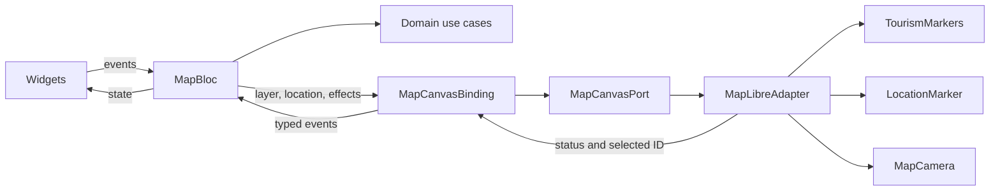

# Map presentation

The page uses three domain operations: `LoadMapLayer`, `WatchLocation`, and
`OpenLocationSettings`. `MapBloc` owns the page state and emits one-time visual
commands. Native rendering belongs to a route-owned canvas component.

## Files and ownership

Implementation lives under `lib/src/map`. Injectable composition remains in
`lib/di`, and feature-owned AutoRoute composition remains in `lib/src/navigation`.

| Component | Responsibility |
| --- | --- |
| `bloc/map_bloc.dart` | Calls use cases, handles each event separately, and updates page state. |
| `bloc/map_state.dart` | Loaded layer, latest location, selection, loading and user-facing feedback. |
| `bloc/map_effect.dart` | Explicit zoom, focus and canvas retry commands. |
| `models/place_details.dart` | Immutable, value-equal popup content. |
| `pages` and `widgets` | Render selected state fields and dispatch events. |
| `canvas/map_canvas.dart` | Hosts the MapLibre widget and forwards native callbacks. |
| `canvas/map_canvas_binding.dart` | Connects streams and callbacks; never stores or resolves a Bloc. |
| `canvas/map_canvas_port.dart` | SDK-free visual operations and observation streams. |
| `canvas/map_pan_observer.dart` | Reports deliberate drags while leaving native gesture handling intact. |
| `canvas/maplibre/maplibre_adapter.dart` | Native attachment, readiness, deadlines and ordered work. |
| `canvas/maplibre/tourism_markers.dart` | Tourism annotations and stable place IDs. |
| `canvas/maplibre/location_marker.dart` | Position circle and heading symbol supplied by shared location. |
| `canvas/maplibre/map_camera.dart` | Camera mode, framing, zoom and continuous follow. |

The route creates the Bloc and adapter through Injectable, wires the binding,
and releases all three on removal. The SDK widget owns its native controller.
Each loaded style owns its tourism/location annotation handles. Replacing a
style releases those handles; replacing a controller also gets a fresh operation
queue so it does not wait for an old controller's pending call.

## Why annotation APIs

This case study displays a small point layer. `addCircles`, `updateCircle`, and
`onCircleTapped` let the SDK own source IDs, GeoJSON serialization, style-layer
creation, and hit testing. The application does not maintain a scene diff,
render-plan hierarchy or a custom asynchronous feature-query pipeline.

`TourismMarkers` attaches the domain place ID to each circle. A tap emits that
ID, and the Bloc selects the current domain value for the popup. An equal layer
refresh leaves annotations and selection intact. Changed attributes update the
popup by ID; removing that ID clears it. Background taps dismiss selection.
Retired annotations cannot select a place after their style or data is replaced.

The SDK can change its in-memory annotation collection before a native write
fails. Tourism replacement therefore reconciles only annotations it owns,
including ones left by failed additions. Location updates record confirmed
position and heading independently. Retrying a failed heading update preserves
confirmed position, and heading-only updates do not rewrite tourism markers.

`LocationMarker` uses the existing static arrow asset at native display density.
Symbol options do not expose rotation alignment or placement, so the adapter
configures those properties once on the SDK-owned symbol layer. Geometry and
bearing updates still use the annotation API. Missing bearing removes the arrow.
The layer resolves each annotation's image ID with `image` and converts size and
rotation with `to-number`. Untyped expressions left the runtime image invisible
or used default scale/rotation on Android despite valid annotation values.

This approach targets the current point dataset. Clustering, large datasets, or
more complex geometry may justify dedicated GeoJSON/vector sources later.

## State, commands and asynchronous behavior

The page has one Bloc. Layer and location are direct state fields; there is no
nested rendering scene or duplicated camera focus in page state. The binding
observes those values independently with equality filtering. Map readiness and
popup changes do not trigger native data writes. Header, status card and overlay
builders select only their displayed fields.

Camera mode belongs to `MapCamera`. Every focus button tap is an explicit command,
including repeated requests while page values are equal. A queued focus prevents
an automatic update from issuing the same movement first. A newer pan supersedes
that focus. Camera cancellation does not confirm a position; the next update or
explicit command uses current intent. An accepted iOS animation acknowledgment
may be null, while false denotes cancellation.

One operation queue orders annotation updates and camera commands for the current
controller. While a write is pending, new fixes replace the desired location.
After the current pass, at most one next pass reads the latest values. Camera
follow reads current intent after annotation I/O rather than an old captured
position. Explicit zoom commands retain queue order. Closing or replacing the
style prevents later operations and public error/status emissions from old work.
An already-issued SDK call may still complete on its original controller.

Native creation and style loading each have a 25-second deadline. A creation
timeout unmounts the stalled SDK widget; retry mounts a new view while retaining
page data and the GPS subscription. A style retry restores annotations from the
latest inputs. This is a timeout fallback because the SDK does not expose a
widget callback for every native initialization/style failure.

Native exceptions and stack traces stay in the internal `map.canvas` log, with
the failed operation named. The page receives an SDK-free status. Layer requests
use `restartable()`; a late response cannot overwrite a newer layer. A delayed
Settings failure cannot replace feedback after GPS has recovered.

## Location and data boundaries

Datasources expose technical DTOs and exceptions. Repositories select/combine
sources, map entities, and translate errors. Use cases coordinate repositories.
MapLibre calls are visual SDK operations in the presentation adapter; they do
not fetch business data or participate in the domain repository contract.

`WatchLocation` coordinates access, tracking and application visibility through
shared repositories. Permission prompting, passive Settings recovery, sensor
acquisition and cancellation stay outside the map feature. Returning from
Settings can restart tracking without another tap; backgrounding releases it.
`OpenLocationSettings` handles an explicit recovery action. The map adapter does
not request permission, subscribe to device sensors or open Settings.

Valid compass headings take priority over GPS course, are rounded to a degree,
and are limited to ten updates per second. GPS course is used at sufficient
movement speed when compass data is unavailable. Android requests high-accuracy
positions at a one-second interval; the first-fix deadline is 20 seconds.

Follow uses an 800 ms center-only `easeCamera` update. It preserves zoom and avoids
the repeated label fades caused by Android flight animations. Bearing-only
updates rotate the arrow without moving the camera. A deliberate pan stops
follow, while tap jitter does not.

The MAPID mapper removes a known corrupted alias suffix from place names. Raw
DTOs preserve the response; valid Unicode and other parenthetical names remain
intact. The API already contains replacement characters, so HTTP headers or
fonts cannot reconstruct the missing alias bytes.

## Verification

Tests cover the SDK annotation mutation contract, equal refreshes, stale handles,
partial failures, heading updates, camera cancellation, coalesced fixes, explicit
commands, style restoration, controller replacement and disposal. Generated
AutoRoute/Injectable route tests exercise the real page and SDK widget with only
native platform operations replaced. Physical Android results and build-specific
limits are recorded in [validation.md](validation.md).
