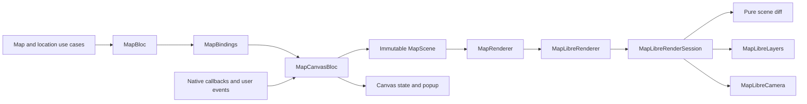

# Map architecture

Screen data, user intent, and native rendering have separate owners. Device
location is a shared capability under `core/location`, so another feature can
use it without importing the map feature.

Domain packages remain independent of Flutter, transport clients, and platform
I/O. The dependency checker explicitly permits the pure Dart `collection`
utilities used for value equality; UI and Bloc ownership rules still apply.

## Responsibilities

| Component | Responsibility |
| --- | --- |
| `core_location_domain` | Location fixes, repository contract, and use cases. |
| `core_location_data` | Geolocator and compass adapters, foreground lifecycle, permissions, and settings launches. |
| `MapBloc` | Fetching layer data, observing live location, retries, and location recovery actions. |
| `MapState` | Screen data and presentation messages; the source of loaded data. |
| `MapBindings` | Forwarding changed `MapContent` snapshots as canvas events. |
| `MapCanvasBloc` | Desired scene, camera intent, selection, and renderer status in UI state. |
| `MapScene` | Immutable content and camera focus to display. |
| `MapRenderer` | Presentation rendering contract; native attachment exposes the SDK controller. |
| `MapLibreRenderer` | Retaining the latest scene and replacing native sessions on attachment. |
| `MapLibreRenderSession` | One controller's style readiness, operation queue, timeout, and applied scene. |
| `MapRenderBaseline` | Independently confirmed source content and camera intent. |
| `diffMapScene` | Pure calculation of changed sources and required camera movement. |
| `MapLibreLayers` | Native source/layer updates and feature hit testing. |
| GeoJSON encoders | Pure conversion of domain data to GeoJSON. |
| `MapLibreCamera` | Native camera updates, bounds, and padding. |

Widgets render state and dispatch events. Neither Bloc depends on the other.
Header and viewport builders subscribe only to changes in their displayed
fields. Location updates do not rebuild the layer header or unrelated canvas
overlays; the location card rebuilds when its displayed status or bearing changes.
`MapBloc` imports no map SDK and owns no native resources. `MapCanvasBloc` has
one injected dependency, `MapRenderer`; it has no native controller field, timer,
lock, or manual stream subscription. The architecture checker enforces the
rendering contract boundary and rejects feature dependencies from shared location.

## Lifecycle and ordering

Injectable creates a renderer for each route's canvas Bloc. On native attachment,
the adapter creates a session bound permanently to that controller and closes
the previous session. Commands already issued to an old controller cannot be
redirected to a replacement. `MapLibreMap` owns native controller disposal;
the session owns its timeout, status stream, and queued work.

Every canvas event has its own typed `on<Event>` registration and named handler.
The Bloc observes renderer status through `emit.forEach`; closing the Bloc or
reattaching cancels that subscription. Asynchronous feature picks use
`restartable()` so an earlier tap cannot overwrite a later one. A dismissed
popup or replaced dataset also invalidates a pending pick.

The session serializes native operations with one `synchronized` lock. One
pending scene replaces older waiting scenes. After a draw, any newer scene is
scheduled behind explicit commands such as zoom, so continuous sensor updates
cannot starve those commands. After writing sources, the session reads the
newest camera intent before issuing movement; a pan while a source write is
pending therefore prevents the old follow command. The camera can follow the
newest fix while its source update waits for the next draw, so continuous input
does not require the renderer to become idle. An explicit focus request
survives coalescing only while its focus still matches the newest scene.

Applying `sequential()` separately to Bloc event types would not serialize
source updates against camera commands. Closing a session cancels its timeout
and prevents queued operations, subsequent changes, and late status publication.
An already-issued platform call can finish; the widget owns native disposal.

The renderer retains the latest scene even before a controller exists. A session
writes no sources until `onStyleLoadedCallback` fires. Loading or replacing a
style restores both sources and the current camera intent, because MapLibre
removes custom sources and layers during style replacement.

`diffMapScene` compares the confirmed source and camera baselines with the desired
scene. Each successful operation advances only its corresponding baseline.
Source failures invalidate source content; camera failures retain confirmed
sources and the last successful camera intent for retry. Read-only hit-test
failures return a typed failure without invalidating either baseline or changing
render status. Native exceptions and stack traces are retained in the internal
`map.renderer` diagnostic log.

Unchanged content requires no native writes. Removing content clears its source.
Source and layer existence are checked independently so a failed layer creation
can recover even when its source already exists. Replacing the style invalidates
both baselines and restores the newest desired scene.

Camera focus is explicit scene state. Late GPS data updates the location marker
without overriding a newer request to show the tourism layer. Refreshing the
layer while GPS is focused leaves the camera there. An explicit `focus(scene)`
command recenters even if the scene is unchanged after a manual pan; no revision
counter is needed. GPS updates preserve an open place popup.

Layer identity is content-based: the layer name, ordered place values, and
coordinates participate in equality. A refresh decoding identical content does
not rewrite GeoJSON, refit the camera, or dismiss a popup. Selection retains the
stable place ID; changed attributes update the popup, and removing that ID
clears it. A pending hit test against changed content is still discarded.

MapLibre GL 0.27.1 exposes a style-ready callback but no widget-level style-error
callback. A 25-second session timer reports stalled loading through the typed
`MapRenderStatus` stream. Reloading starts a new timeout; successful style loading
or session closure cancels it. UI error text belongs to `MapCanvasState`.

## Foreground location and bearing

`WatchLocation` exposes one cancellable stream through `LocationRepository`.
The data layer combines the GPS and compass sources with RxDart. Android requests
high-accuracy updates at a one-second interval and zero distance filter; the OS
controls actual delivery. The first fix races a 20-second deadline. Once a fix
arrives, that deadline is cancelled, so stationary tracking never times out.
Stream errors become typed failures and release both sensor subscriptions.
The lifecycle observer remains active so permission or GPS changes in Android
Settings can recover without another location-button tap.

The shared data layer observes application visibility. Backgrounding cancels
both sensor subscriptions; resuming checks access before creating fresh streams.
Only an explicit tracking request may open a permission dialog; automatic resume
is a passive check. Inactive states such as permission dialogs do not interrupt
the request. Cancelling the consumer also removes the lifecycle observer.
`MapBloc` uses `emit.forEach` and filters duplicate requests while tracking or
acquiring. An explicit retry after failure replaces the previous watcher through
`restartable()`. Closing the route releases the subscription automatically.

`LocationBearing` distinguishes magnetic compass heading from GPS movement
direction. Valid compass readings take priority, are rounded to one degree,
and are limited to ten updates per second. Without a reliable compass reading,
GPS course is used only at speeds of at least 0.5 m/s. When neither is available,
the arrow is hidden. Compass quality depends on calibration and nearby magnetic
interference.

The MapLibre symbol rotates relative to the map using a bearing property in the
location source. Its image and layer are recreated after style replacement.
The image is rasterized at the native display's pixel ratio; the web SDK uses
1x image pixels. This keeps the arrow's size consistent with the location dot.
`diffMapScene` treats heading changes separately from coordinate changes, so
turning the phone does not move the camera. GPS follow uses a center-only
`easeCamera` update over 800 ms, preserving zoom throughout the animation.
Android's `animateCamera` uses a flight path that briefly zooms out; at integer
zooms this crosses tile boundaries and repeatedly replaces road/building labels
([MapLibre Native #2477](https://github.com/maplibre/maplibre-native/issues/2477)).
Explicit recentering can still animate to street-level zoom. A gesture observer
dispatches `MapCanvasPanned` once pointer displacement
exceeds Flutter's device-aware pan slop, switching camera intent to `free`.
Small tap movements preserve follow. The observer immediately declines the
gesture arena and continues listening to pointer events, leaving native taps
and drags to MapLibre. `RawGestureDetector` owns its lifecycle; cancellation and
disposal release pointer tracking. GPS and compass updates continue until the
route closes or app hides. An explicit location action restores follow.
Widgets only render and dispatch.

## Validation

Pure diff tests cover source replacement, clearing, idempotence, and camera
intent. Bloc tests use the renderer contract to check selection, stale taps,
status observation, and subscription cancellation. Renderer tests exercise the
actual adapter, session, layers, and camera against a mocked SDK controller,
including partial failures, rollback, controller replacement, style timeouts,
and disposal during native work. Widget tests check event bindings and popup
content. Physical Android checks validate native tiles, markers, popup, and GPS.

## References

- [Flutter architecture recommendations](https://docs.flutter.dev/app-architecture/recommendations): separation of concerns, immutable models, and logic outside widgets.
- [Bloc architecture](https://github.com/felangel/bloc/blob/master/docs/src/content/docs/architecture.mdx): presentation bindings without Bloc-to-Bloc dependencies.
- [MapLibre annotations and style layers](https://github.com/maplibre/flutter-maplibre-gl/blob/main/website/docs/concepts/annotations-vs-layers.md): readiness, style replacement, batched updates, and feature queries.
- [MapLibre GeoJSON sources](https://github.com/maplibre/flutter-maplibre-gl/blob/main/website/docs/layers/geojson-source.md): source creation and replacement.

These component boundaries are project design decisions based on those
constraints; they are not an architecture prescribed by the map SDK.
