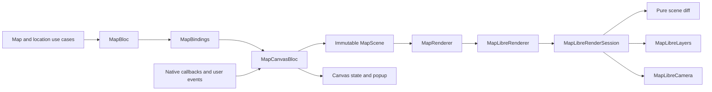

# Map architecture

Screen data, user intent, and native rendering have separate owners. Device
location is a shared capability under `core/location`, so another feature can
use it without importing the map feature.

## Responsibilities

| Component | Responsibility |
| --- | --- |
| `core_location_domain` | Location fixes, repository contract, and use cases. |
| `core_location_data` | Geolocator, foreground permission checks, GPS access, and settings launches. |
| `MapBloc` | Fetching layer/location data, retries, and location recovery actions. |
| `MapState` | Screen data and presentation messages; the source of loaded data. |
| `MapBindings` | Forwarding changed `MapContent` snapshots as canvas events. |
| `MapCanvasBloc` | Desired scene, camera intent, selection, and renderer status in UI state. |
| `MapScene` | Immutable content and camera focus to display. |
| `MapRenderer` | Presentation rendering contract; native attachment exposes the SDK controller. |
| `MapLibreRenderer` | Retaining the latest scene and replacing native sessions on attachment. |
| `MapLibreRenderSession` | One controller's style readiness, operation queue, timeout, and applied scene. |
| `diffMapScene` | Pure calculation of changed sources and required camera movement. |
| `MapLibreLayers` | Native source/layer updates and feature hit testing. |
| GeoJSON encoders | Pure conversion of domain data to GeoJSON. |
| `MapLibreCamera` | Native camera updates, bounds, and padding. |

Widgets render state and dispatch events. Neither Bloc depends on the other.
`MapBloc` imports no map SDK and owns no native resources. `MapCanvasBloc` has
one injected dependency, `MapRenderer`; it has no native controller field, timer,
lock, or manual stream subscription. The architecture checker enforces the
rendering contract boundary and rejects feature dependencies from shared location.

## Lifecycle and ordering

Injectable creates a renderer for each route's canvas Bloc. On native attachment,
the adapter creates a session bound permanently to that controller and closes
the previous session. Commands already issued to an old controller cannot be
redirected to a replacement. `MapLibreMap` owns native controller disposal;
the session owns its timeout, status stream, and queued work.

Every canvas event has its own typed `on<Event>` registration and named handler.
The Bloc observes renderer status through `emit.forEach`; closing the Bloc or
reattaching cancels that subscription. Asynchronous feature picks use
`restartable()` so an earlier tap cannot overwrite a later one. A dismissed
popup or replaced dataset also invalidates a pending pick.

The session serializes native operations with one `synchronized` lock. Applying
`sequential()` separately to Bloc event types would not serialize source updates
against camera commands. Closing a session cancels its timeout and prevents
queued operations, subsequent scene changes, and late status publication.
An already-issued platform call can finish; the widget owns native disposal.

The renderer retains the latest scene even before a controller exists. A session
writes no sources until `onStyleLoadedCallback` fires. Loading or replacing a
style restores both sources and the current camera intent, because MapLibre
removes custom sources and layers during style replacement.

`diffMapScene` compares the last completely applied scene with the desired one.
Unchanged content requires no native writes. Removing content clears its source.
A partial native failure invalidates the baseline, ensuring a retry or rollback
reconciles all sources. Source and layer existence are checked independently so
a failed layer creation can recover even when its source already exists.

Camera focus is explicit scene state. Late GPS data updates the location marker
without overriding a newer request to show the tourism layer. Refreshing the
layer while GPS is focused leaves the camera there. An explicit `focus(scene)`
command recenters even if the scene is unchanged after a manual pan; no revision
counter is needed. GPS updates preserve an open place popup.

MapLibre GL 0.27.1 exposes a style-ready callback but no widget-level style-error
callback. A 25-second session timer reports stalled loading through the typed
`MapRenderStatus` stream. Reloading starts a new timeout; successful style loading
or session closure cancels it. UI error text belongs to `MapCanvasState`.

## Validation

Pure diff tests cover source replacement, clearing, idempotence, and camera
intent. Bloc tests use the renderer contract to check selection, stale taps,
status observation, and subscription cancellation. Renderer tests exercise the
actual adapter, session, layers, and camera against a mocked SDK controller,
including partial failures, rollback, controller replacement, style timeouts,
and disposal during native work. Widget tests check event bindings and popup
content. Physical Android checks validate native tiles, markers, popup, and GPS.

## References

- [Flutter architecture recommendations](https://docs.flutter.dev/app-architecture/recommendations): separation of concerns, immutable models, and logic outside widgets.
- [Bloc architecture](https://github.com/felangel/bloc/blob/master/docs/src/content/docs/architecture.mdx): presentation bindings without Bloc-to-Bloc dependencies.
- [MapLibre annotations and style layers](https://github.com/maplibre/flutter-maplibre-gl/blob/main/website/docs/concepts/annotations-vs-layers.md): readiness, style replacement, batched updates, and feature queries.
- [MapLibre GeoJSON sources](https://github.com/maplibre/flutter-maplibre-gl/blob/main/website/docs/layers/geojson-source.md): source creation and replacement.

These component boundaries are project design decisions based on those
constraints; they are not an architecture prescribed by the map SDK.
