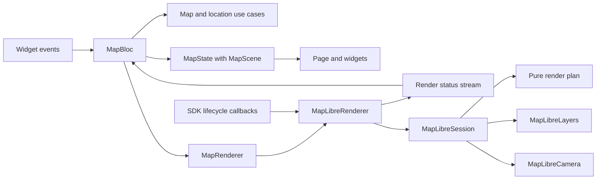

# Map architecture

One `MapBloc` owns the page state: loaded places, live location, selected place,
camera intent, and render status. Native resources belong to the route-owned
MapLibre adapter. Shared location remains under `packages/core/location`.

Domain values use Equatable. Presentation state and `MapScene` use Freezed.
Datasources expose DTOs and technical exceptions; repositories select and combine
sources, map entities, and return domain failures. No SDK controller, Flutter UI
type, or raw platform exception crosses the Bloc contract.

## Presentation structure

`lib/di` contains Injectable composition. Feature implementation lives under
`lib/src/map`: `bloc`, `models`, `pages`, `widgets`, `gestures`, and `rendering`.
AutoRoute configuration lives under `lib/src/navigation`.

| File | Responsibility |
| --- | --- |
| `map_renderer.dart` | SDK-free rendering commands and the render-status enum. |
| `maplibre_renderer.dart` | Latest desired scene, native attachment, stable status observation, and session replacement. |
| `maplibre_session.dart` | One controller's readiness, timeout, serialized operations, and applied state. |
| `map_render_plan.dart` | Pure diff, confirmed source/camera baseline, and related change types. |
| `maplibre_camera.dart` | Camera bounds, zoom, recentering, and continuous follow. |
| `maplibre_layers.dart` | GeoJSON encoding, native sources/layers, heading asset, and visual hit testing. |

Related presentation contracts, enums, and payloads can share a file. Internal
layer IDs and encoders stay private to their implementation. Domain entities,
DTOs, repositories, and use cases have separate files. Architecture checks focus
on dependency, I/O, and resource ownership boundaries.

`MapState.scene` holds the layer, location, and focus directly. There is no
second canvas Bloc or content-forwarding binding. Every event has a typed
registration and its own handler. The location button sends one event; the Bloc
requests focus and decides whether to acquire location or open settings.
Widgets render state and dispatch events. Header, viewport, and location-card
builders select only their displayed fields, so compass updates leave unrelated
widgets and an open popup intact.

## Lifecycle and asynchronous work

The feature route creates one `MapLibreRenderer` through Injectable, passes it
to `MapBloc` as a `MapRenderer` factory parameter, and disposes it on route removal.
The native widget sends creation and style callbacks directly to the adapter.
The widget owns controller disposal; each session owns its timeout, status
stream, and operation queue. Replacing a controller closes its old session.

The Bloc observes renderer status and location through `emit.forEach`. Closing
it cancels both subscriptions and pending picks. A duplicate start does not add
another status observer. The adapter replays its latest status to late observers.
Layer requests and feature picks use `restartable()`; a late response cannot
replace newer data or reopen a dismissed popup. Handlers apply results to the
current state, preserving GPS updates and camera intent received during I/O.

One session lock serializes native work. Waiting scene updates coalesce into the
newest scene. Explicit commands, including zoom, remain ordered between draws.
After source I/O, the session reads the latest camera intent, so a pan supersedes
an old follow request. Camera progress does not wait for continuous sensor input
to stop. Pending work and late status emission are discarded after session close.
An already-issued platform call may finish against its original controller.

Sources are written only after style readiness. Reloading or replacing a style
restores custom sources, layers, and current camera intent. A 25-second timeout
reports stalled style loading because MapLibre GL 0.27.1 has no widget-level
style-error callback. Successful loading, replacement, and disposal cancel it.

The render plan tracks confirmed sources and camera progress independently.
A successful operation advances only its own baseline. Source failures invalidate
source progress; camera failures preserve confirmed source content. Hit-test
failures preserve both baselines and the current selection. Native exceptions
and stack traces remain in the internal `map.renderer` diagnostic log.

Layer equality includes its name and ordered place values. Identical refreshes
need no native write or camera refit and preserve the popup. Changed attributes
update selection by stable ID; removing that ID clears it. GPS updates and layer
refreshes respect the current camera focus. Explicit focus commands recenter even
when scene values are unchanged.

## Location and heading

`WatchLocation` exposes a cancellable repository stream. OS adapters return raw
fixes, sensor readings, and permission results. The repository maps entities and
technical failures, including permanent denial. Compass failure is logged and
falls back to GPS movement bearing while location tracking continues.

Android requests high-accuracy positions at a one-second interval. A 20-second
first-fix deadline is cancelled after the first result, so stationary tracking
does not time out. Backgrounding releases sensors. Resuming checks access again
without prompting; only an explicit request may open the permission dialog.
The lifecycle observer survives permission/service failure so returning from
Settings can recover tracking without another tap. Explicit retry replaces the
previous watch; closing the route releases it.

Valid compass headings take priority, are rounded to a degree, and are limited
to ten updates per second. GPS course is used at speeds of at least 0.5 m/s when
compass data is unavailable. Without either bearing, the arrow is hidden.
The static heading image is decoded at native display density, including
fractional ratios; web uses 1x. Its symbol rotates relative to the map.

Heading-only updates change the source without moving the camera. GPS follow
uses a center-only `easeCamera` transition over 800 ms, preserving zoom and
avoiding the label fades caused by repeated Android flight animations
([MapLibre Native #2477](https://github.com/maplibre/maplibre-native/issues/2477)).
A deliberate pan changes focus to `free`; tap jitter does not. The gesture
observer leaves native taps and drags to MapLibre, while `RawGestureDetector`
owns observer disposal. GPS and compass keep updating until the app hides or
route closes. The location action restores follow.

## Validation

Tests cover value equality, raw datasource boundaries, sensor recovery, pure
render planning, native failures, ordering, coalescing, stale requests/picks,
selection, and resource disposal. Page tests verify user-event bindings and
rebuild scope. The route test uses generated Injectable and AutoRoute composition
with the actual page and map widget; only native platform operations are mocked.
Android verification and its build-specific limits are recorded in
[validation.md](validation.md).
