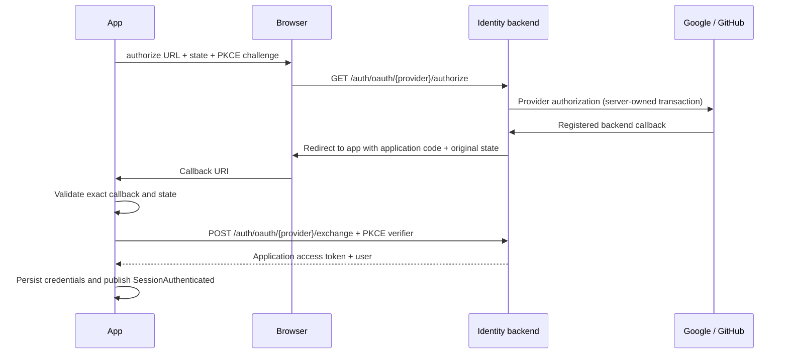

# Provider sign-in

Password, Google and GitHub all produce the same `Session` in `identity_domain`.
`LoginBloc` depends on `Login` and `LoginWithProvider`; home and navigation observe
`WatchSession` and read `GetCurrentSession`. Features never share a Bloc. Identity
data owns the repository, browser adapter, Retrofit datasource and session persistence.
Its Injectable micro-package registers the domain use cases. `LoginWithProvider`
checks provider availability and admits one authorization at a time. It is shared
per DI container so multiple callers cannot invalidate an active attempt. The
repository maps datasource results and delegates session lifecycle to `IdentitySession`; route Blocs own presentation loading state.

## Demo

Run any existing demo editor preset or:

```sh
dart run tool/app.dart run android dev --device=10.77.77.3:5555
```

The Google/GitHub buttons simulate authorization, callback validation, a one-time
code exchange, and session persistence using `DemoAdapter`. They return
`google@example.com` / `github@example.com`. No external provider, browser, account
or backend is involved. Password login remains `demo@example.com` / `Demo123!`.

## Connect a backend

There is no OAuth server in this repository. The client implements the broker
contract below; live provider sign-in requires that server and registered provider
applications. Provider client secrets and provider tokens stay on the server.

Providers are disabled by default in API mode. Enable only the ones deployed:

```sh
dart run tool/app.dart run android dev \
  --api=https://api.example.com \
  --oauth-providers=google,github \
  --oauth-redirect=dev.example.fluentstarter.dev.oauth://oauth/callback
```

Editor API profiles can pass the equivalent Flutter arguments:
`--dart-define=OAUTH_PROVIDERS=google,github` and
`--dart-define=OAUTH_REDIRECT_URI=<callback>` alongside the existing API flags.
Do not put a client secret in Dart defines, assets, or the app.

| Target | App callback |
| --- | --- |
| Android dev | `dev.example.fluentstarter.dev.oauth://oauth/callback` |
| Android staging | `dev.example.fluentstarter.staging.oauth://oauth/callback` |
| Android prod | `dev.example.fluentstarter.oauth://oauth/callback` |
| iOS / macOS | A unique bundle-specific `.oauth` scheme, e.g. the Android values above |
| Web | Same origin as the app, e.g. `https://app.example.com/auth.html` |
| Linux / Windows | Explicit loopback port, e.g. `http://localhost:43821/auth.html` |

Android's callback activity derives its scheme from `${applicationId}.oauth`,
with host `oauth` and path `/callback`. Update the configured callback after
changing application IDs. iOS/macOS use `ASWebAuthenticationSession`, which handles
the custom scheme callback. Linux/Windows use an external browser and the plugin's
temporary localhost listener; the selected port must be free. HTTPS universal/app
links need platform association files and manifest/entitlement setup of your own;
the boilerplate's native presets use custom schemes.

Web deploys `web/auth.html` and `web/auth.js` as real static files, excluded from SPA fallback. It
posts the callback only to its same-origin opener and removes the code from its
history entry. Serve them with `Cache-Control: no-store` and allow the same-origin
callback script in your CSP. Preserve the
popup/opener relationship in your COOP configuration, e.g.
`same-origin-allow-popups` on the app. Enable CORS on the exchange endpoint only
for registered web app origins. Use HTTPS for web deployments, including testing
the real OAuth flow. Closing a web popup may be reported only after the plugin's
timeout; native browser cancellation is mapped to a silent cancelled result.

`flutter_web_auth_2` uses the system browser (`useWebview: false`). Its desktop
dependency still requires WebKitGTK development libraries on Linux:
`libwebkit2gtk-4.1-dev` on Ubuntu or `webkit2gtk-4.1` on Arch. CI installs them.

## Broker contract



### 1. Start authorization

`GET /auth/oauth/{provider}/authorize`, where provider is `google` or `github`:

| Query | Meaning |
| --- | --- |
| `redirect_uri` | Exact registered app callback |
| `state` | Random 256-bit value generated per app attempt |
| `code_challenge` | Base64url SHA-256 of a separate random 256-bit verifier |
| `code_challenge_method` | `S256` only |

This URL opens directly in the browser. No application bearer token is attached.
The backend must allowlist the exact callback per client/environment, retain the
app transaction, and use a separate provider transaction/state (and OIDC nonce for
Google). Do not treat the app's state as validation of the provider's callback.

The provider redirects to a **backend** callback registered in its console,
for example `https://api.example.com/auth/oauth/google/callback`. The backend
exchanges the provider code, validates issuer/audience/nonce/signature/expiry where
applicable, and resolves the local identity from provider + stable provider ID.
GitHub email may be private or absent: fetch a verified email if your app requires
one. Do not automatically link existing accounts merely because emails match;
linking requires an authenticated account and a separate explicit flow.

Then redirect to the registered app URI with:

```text
<app-callback>?code=<one-time-application-code>&state=<original-app-state>
```

Use a cryptographically random, short-lived code (for example 60 seconds), bound
to provider, client, exact callback and PKCE challenge. Do not forward a provider
code, ID token or access token through the app callback. On denial, return
`error=access_denied&state=<original-app-state>` to the validated callback. The
client rejects wrong state, URI, duplicate parameters, fragments, and mixed
code/error responses before sending an exchange request.

### 2. Exchange the application code

`POST /auth/oauth/{provider}/exchange`, JSON body, without a bearer token:

```json
{
  "code": "one-time-application-code",
  "code_verifier": "base64url-random-verifier",
  "redirect_uri": "dev.example.fluentstarter.dev.oauth://oauth/callback"
}
```

Atomically consume and validate the code, expiry, client, provider, callback and
S256 proof. Reject replay, mismatched proof and expired transactions. Respond with
the same application session payload used by password login:

```json
{
  "access_token": "application-session-token",
  "user": {
    "id": "user-123",
    "email": "person@example.com",
    "display_name": "Person"
  }
}
```

Use `Cache-Control: no-store`. Return 400/401 for invalid transactions, 429 for rate
limits, and 5xx for backend failures; `safeApiCall` maps Dio errors consistently.
Do not log authorization URLs, codes, verifiers, tokens or provider responses.
`GET /auth/me` must accept the resulting application token. Refresh/revocation and
account linking are separate backend capabilities, not implemented by this starter.

## Extend providers

Add an `IdentityProvider` enum case, its `LoginProvider` label and the exhaustive
mapping in `LoginBloc`, then implement/enable that provider on the backend. For
demo coverage, add its demo user. The repository, use case, exchange DTO, routes,
shared session and DI graph are reused; no per-provider app binding is needed.

Generated files come from `dart run melos run generate --no-select`.
